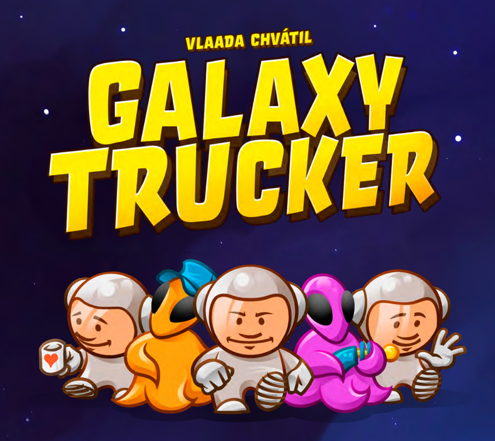

<div align="center">
  

# 🚀 Galaxy Truckers

**IS25-AM17 – Software Engineering Project**  
*Politecnico di Milano (2024–2025)*
  
---

**👥 Team**  
Davide Cutrupi • Tommaso D'Alessio • Simone De Carlo • Davide Di Tanna

</div>

---

## 📖 Project Overview

This project is a **digital adaptation** of the acclaimed board game *Galaxy Trucker* by Cranio Creations.

### 🎯 Key Highlights
- **Single-server architecture** supporting multiple concurrent matches
- **2-4 players** per game session
- **Dual interface support**: Command-Line Interface (CLI) & Graphical User Interface (GUI)
- Built following **software engineering best practices**
- Extensive use of **design patterns**, particularly **MVC (Model-View-Controller)**

> 📋 Detailed technical documentation covering networking, communication protocols, and system architecture is available in the project documentation.

---

## ✨ Features Implemented

### 🎮 Core Gameplay
The project includes all base gameplay mechanics plus **3 out of 4 advanced modules**.

### 📊 Development Status

| Feature | Status | Description |
|---------|--------|-------------|
| **Base game rules** | ✅ | Complete core gameplay implementation |
| **Full ruleset** | ✅ | All official rules integrated |
| **Socket networking** | ✅ | TCP/IP socket-based communication |
| **RMI networking** | ✅ | Java RMI remote method invocation |
| **CLI Interface** | ✅ | Text-based user interface |
| **GUI Interface** | ✅ | JavaFX graphical interface |
| **Multiple games*** | ✅ | Concurrent game sessions support |
| **Learning flight*** | ✅ | Tutorial/practice mode |
| **Resilience & recovery*** | ✅ | Connection recovery mechanisms |
| **Persistence*** | ❌ | Save/load game state |

> ***Advanced Functions**

---

## 📚 Documentation

### 📁 Structure
All documentation is organized in the `/deliveries` folder.

### 🎨 UML Diagrams
**Location:** `/deliveries/UML`

### 📊 Sequence Diagrams
**Location:** `/deliveries/sequenceDiagram`

### 📖 JavaDoc
**Location:** `/deliveries/javadoc`

Comprehensive documentation covering the most significant classes and methods.

---

## 🛠️ Technology Stack

| Technology | Purpose | Role |
|------------|---------|------|
| **☕ Java 21+** | Core Language | Application development |
| **📦 Maven** | Build Tool | Dependency management & compilation |
| **🎨 JavaFX** | GUI Framework | Graphical user interface |
| **🧪 JUnit** | Testing | Unit testing framework |
| **🎭 Shade Plugin** | Packaging | JAR file creation |

---

## 💻 Installation & Execution

### 🖥️ Windows Setup

#### 🖲️ Server Launch
```bash
java -jar IS25-AM17-Windows.jar server
```

#### 👤 Client Setup & Launch

**Option 1: PowerShell**
```powershell
# Set UTF-8 encoding
chcp 65001 | Out-Null
[Console]::OutputEncoding = [System.Text.Encoding]::UTF8
$env:JAVA_TOOL_OPTIONS = '-Dfile.encoding=UTF-8'

# Launch client
java -jar IS25-AM17-Windows.jar client
```

**Option 2: Command Prompt**
```cmd
# Set UTF-8 encoding
chcp 65001 >nul 
set JAVA_TOOL_OPTIONS=-Dfile.encoding=UTF-8

# Launch client
java -jar IS25-AM17-Windows.jar client
```

**Option 3: Automated Batch File**
```bash
.\launch
```

> 💡 **Note**: UTF-8 encoding setup ensures proper TUI interface display.

---

### 🍎 macOS Setup

#### 🖲️ Server Launch
```bash
java -jar IS25-AM17-MacSilicon.jar server
```

#### 👤 Client Launch
```bash
java -jar IS25-AM17-MacSilicon.jar client
```

---

### Every OS:
To compile the project move into the root project folder use the command:
```
mvn clean package 
```
then you should be able to run the package IS25-AM17.  
if you want to run the server you should run:
```
java -jar target/IS25-AM17-1.0-SNAPSHOT-fat.jar server
```
for the client:
```
java -jar target/IS25-AM17-1.0-SNAPSHOT-fat.jar server
```

---

## 🎮 How to Play

1. **Start the server** using the appropriate command for your OS
2. **Launch one or more clients** to join the game
3. **Choose your interface**: CLI for terminal enthusiasts or GUI for visual experience
4. **Create or join a lobby** with 2-4 players
5. **Build your spaceship** and embark on your galactic trucking adventure!

---

<div align="center">

### 🌟 Ready to explore the galaxy?
**Start your trucking adventure today!**
  
---

*Made with ❤️ by the IS25-AM17 team*

</div>
